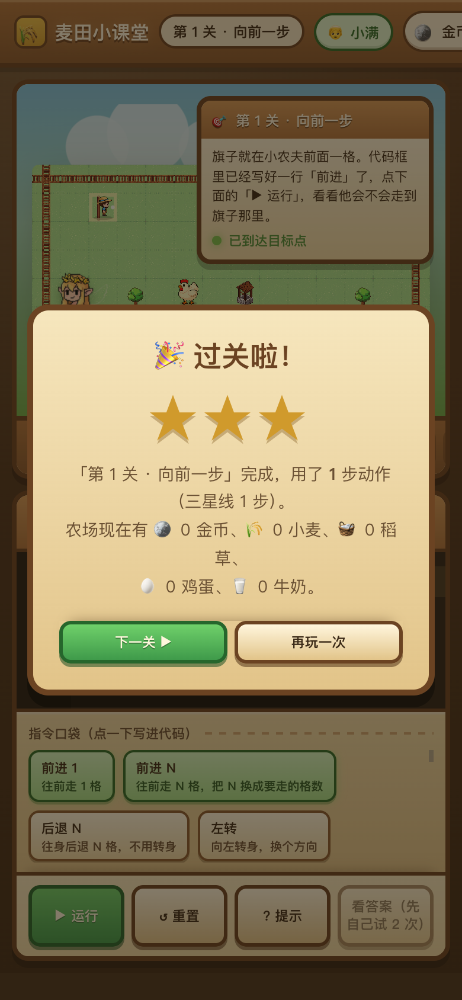
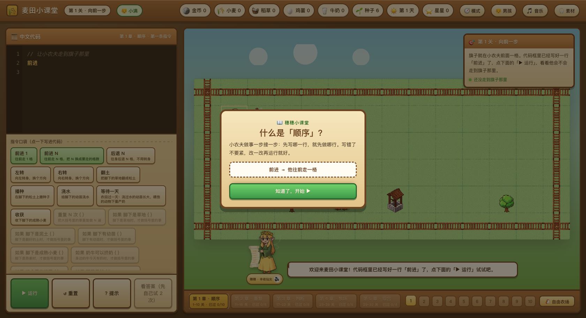
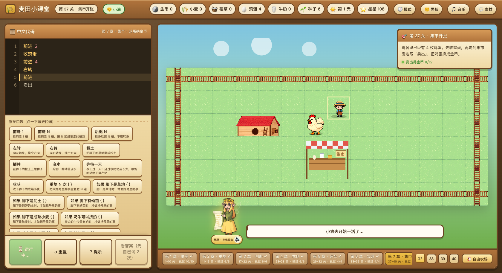
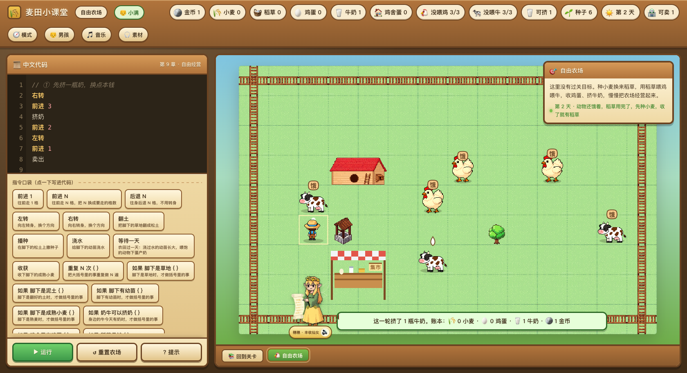
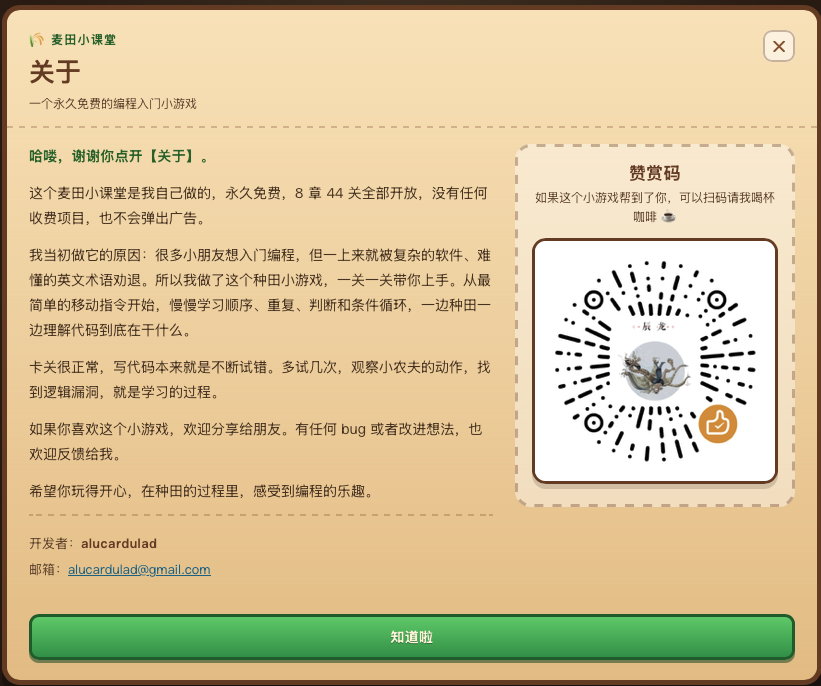

# 🌾 麦田小课堂

**用中文写代码，教小农夫种地。** 一个把「中文代码指令」和「像素农场养成」揉在一起的编程入门小游戏。

孩子在左边写下简单的农活指令，小农夫就在右边的农田里照着做：翻土、播种、浇水、收获，
再去喂鸡、喂牛、收鸡蛋、挤牛奶，最后拉到集市换金币、买回种子接着种。
**8 章 44 关**玩下来，顺序、重复、判断、两选一和条件循环这些基础，
就跟着一锄头一锄头长进手里了。

## ⬇️ 立即下载并开始玩

> **下载安装不用折腾，只有两步：先点链接下载 `code-farm-v2.0.1.html`，再双击打开。**
>
> **不用安装软件，不用配置环境，不用注册，也不用联网。Windows、macOS 和手机浏览器都能直接打开。**

### 单文件 HTML 版

**👉 [点击下载 code-farm-v2.0.1.html](https://gitee.com/alucardulad/code-farm/releases/download/v2.0.1/code-farm-v2.0.1.html)**

下载地址：<https://gitee.com/alucardulad/code-farm/releases/download/v2.0.1/code-farm-v2.0.1.html>

### 下载后怎么玩

1. **点击上面的下载链接**，下载 `code-farm-v2.0.1.html`。
2. **双击下载好的 HTML 文件**，浏览器会自动打开游戏。
3. 手机上可以把文件传到手机，或者在浏览器打开后选择「添加到主屏幕」，玩起来更像小 App。

---

## 📱 手机上也能玩

游戏按「手机也能顺手玩」来设计，竖屏不用左右滚动：



- **布局会自动换位置**：手机竖屏时农场在上面、代码框在下面，点「▶ 运行」时能直接看见小农夫干活。
- **按钮固定在底部**：运行、重置、提示、看答案不会跟着代码滚走。
- **顶栏可以横滑**：金币、小麦、稻草、鸡蛋这些家底排成一条，左右滑就能看全。
- **点按钮也能写代码**：不用打字也能用「指令口袋」拼出完整程序。
- **可以当小 App 用**：手机浏览器里选择「添加到主屏幕」，下次点开就是全屏游戏。

| 设备 | 分辨率 | 效果 |
| --- | --- | --- |
| iPhone SE | 375×667 | 可玩，需要上下滚一点 |
| iPhone 14 | 390×844 | 一屏基本放得下 |
| Pixel 7 | 412×915 | 一屏基本放得下 |
| iPad 竖屏 | 768×1024 | 一屏基本放得下 |
| 手机横屏 | 844×390 | 可玩，农场区可以滚动 |

---

## 📖 孩子会怎么学会写代码

### 开篇只要三步

1. **开篇页**：先认识这片会听懂中文代码的农田，点「开始旅程」。
2. **创建小农夫**：选男孩或女孩，再写一个名字，名字会显示在游戏顶栏。
3. **选择模式**：选**教学模式**跟着 44 关学，或者直接进**自由模式**经营农场。

进入教学后，每一关都只教一个新东西，孩子不用一下子记住很多规则。

| 第一次进入游戏，先看懂一条指令 | 写几行代码，看小农夫照着做 |
| --- | --- |
|  |  |

### 每章先上一节「穗穗小课堂」

换到新章节前，丰收仙女穗穗会先讲清这一章要学什么，再配一个最小例子。
孩子可以先听一遍，再自己动手试。

| 穗穗小课堂：每章先讲一个概念 | 提示不止能看，还能一条条点开听 |
| --- | --- |
|  |  |

### 一关里会发生什么

以“翻土、播种、浇水”为例：

1. 右边的任务卡先告诉孩子这一关要做什么。
2. 左下角的「指令口袋」摆着已经学过的指令，每个按钮都写着一句说明。
3. 孩子自己把指令排好，点 **▶ 运行**。
4. 小农夫一行一行执行，正在跑的那一行会亮起来。
5. 写错了不会突然报一大堆英文。出错行会标红，提示自动展开，穗穗也会用中文讲下一步怎么做。
6. 完成目标就过关，按行动次数评一星到三星。
7. 每章最后一关会先庆祝整章完成，再预告下一章要学什么。

| 过关结算：按步数评三星 | 牧场章：喂鸡、喂牛、收鸡蛋、挤奶 |
| --- | --- |
|  |  |

### 卡住时，工具会扶着走

- 每条提示都能单独点开听，识字不多的孩子也能跟着做。
- 提示会先说整体思路，再说具体每一步。
- 「看答案」有门槛：同一关先自己试两次才解锁，点之前还会再确认一次。
- 第一次失败时提示会自动摊开，孩子不用自己想到“我该去点提示”。
- 还没学到的语法不会直接报错，而是告诉他“这一章先用另一种写法”。

### 第 1 章：10 关走成一条完整农活链

| 关 | 新学到的东西 | 参考做法 |
| --- | --- | --- |
| 1 · 向前一步 | `前进` | `前进` |
| 2 · 走远一点 | 给指令写步数 | `前进 9` |
| 3 · 向右转 | `右转` | `右转` → `前进 3` |
| 4 · 向左转 | `左转` | `左转` → `前进 3` → `右转` → `前进 5` |
| 5 · 后退 | `后退 2`，不用转身 | `后退 2` |
| 6 · 翻土 | `翻土` | `翻土` |
| 7 · 播种 | `播种` | `翻土` → `播种` |
| 8 · 浇水 | `浇水` | `翻土` → `播种` → `浇水` |
| 9 · 等待一天 | 幼苗过一晚长大 | 前 3 步 → `等待一天` |
| 10 · 收获 | 收下熟麦，拿金币和种子 | 前 4 步 → `收获` |

### 孩子会学到的中文指令

| 指令 | 在游戏里做什么 |
| --- | --- |
| `前进 3`、`后退 2` | 往前走、往后退，不用先转身 |
| `左转`、`右转` | 换个方向继续干活 |
| `翻土`、`播种`、`浇水` | 把草地变成能长出小麦的农田 |
| `等待一天`、`收获` | 等幼苗长大，再把成熟小麦收下来 |
| `喂鸡`、`喂牛` | 用稻草把动物喂饱 |
| `收鸡蛋`、`挤奶` | 把鸡蛋和牛奶收进背包 |
| `卖出`、`买种子`、`买稻草` | 到集市换金币，再把农场需要的物资买回来 |
| `买鸡`、`买牛` | 自由模式里扩大养殖规模 |
| `重复 N 次 { ... }` | 同一件事重复做几次 |
| `如果 ... { ... }` | 条件成立时才做 |
| `如果 ... 否则 ...` | 两件事里选一件做 |
| `重复直到 ... { ... }` | 不知道要做几遍时，让条件决定什么时候停 |

条件也都是中文，例如：`脚下是草地`、`脚下是泥土`、`脚下有幼苗`、
`脚下是成熟小麦`、`奶牛可以挤奶`、`鸡舍里有鸡蛋`、`稻草足够`、
`前方是成熟小麦`、`到旗子了`。

---

## 🧭 44 关一路学什么

课程一共 **8 章 44 关**，每一章只引入一个新概念，一关只加一个新台阶：

| 章节 | 关卡 | 这一章学什么 |
| --- | --- | --- |
| 第 1 章 · 顺序 | 1~10 | 前进、转向、后退、翻土、播种、浇水、等待、收获 |
| 第 2 章 · 重复 | 11~16 | 用 `重复 N 次` 收起重复劳动 |
| 第 3 章 · 判断 | 17~22 | 用 `如果` 先看情况再决定 |
| 第 4 章 · 牧场 | 23~28 | 喂鸡、收鸡蛋、喂牛、挤奶 |
| 第 5 章 · 综合 | 29~32 | 在循环里套判断，完成种地 + 养鸡 + 牧牛的一天 |
| 第 6 章 · 经营 | 33~36 | 用 `如果 ... 否则 ...` 安排一整天的农活 |
| 第 7 章 · 集市 | 37~40 | 卖出、买种子、买稻草，让农场一直转下去 |
| 第 8 章 · 自动农活 | 41~44 | 用 `重复直到` 和地图条件自动干活 |

- **新指令不会提前出现**，学到哪一章，指令口袋里才会多出哪一章的东西。
- **章节之间有小结课堂**，每换一章都先讲概念，再进关卡。
- **「买鸡 / 买牛」只在自由模式出现**，教学课程里不需要用到它们。
- **参考答案不会直接摆出来**，孩子先自己写，真的卡住再看提示或答案。
- **每关都反复试过**，确保孩子能靠自己的理解完成。

| 鸡蛋要先收进背包才算数 | 到集市把收成换成金币 |
| --- | --- |
|  |  |

---

## 🏪 自由市场：农场怎么转起来

自由模式不用通关，一开局就有一片现成的农场和一座集市：



### 为什么要有集市

种地要种子，养鸡养牛要稻草。光靠自己收获，农场迟早会缺东西。集市把最后一环补上：

```text
鸡蛋 / 牛奶 / 小麦  ──「卖出」──▶  金币  ──「买种子 / 买稻草」──▶  接着种、接着养
```

### 价目表

| 生意 | 价格 |
| --- | --- |
| 卖出 🥚 鸡蛋 | 3 金币 / 枚 |
| 卖出 🥛 牛奶 | 5 金币 / 瓶 |
| 卖出 🌾 小麦 | 2 金币 / 袋 |
| 买 🌱 种子 | 3 金币 → 2 颗 |
| 买 🧺 稻草 | 4 金币 → 1 捆 |
| 买 🐔 鸡 | 12 金币 → 1 只 |
| 买 🐄 牛 | 20 金币 → 1 头 |

### 「卖出」会把背包里的收成一次卖掉

集市在地图上占 2×2 格，走不过去，只能绕到旁边。站到集市上下左右相邻的格子，
写一行「卖出」，背包里的鸡蛋、牛奶、小麦会一次卖掉，金币一次到账。

站得远、背包空、金币不够、稻草不够，游戏都会用中文说清楚原因，不会只丢一个报错。

### 农场每天怎么转

```text
收获        →  小麦 +5 金币 +2 种子 +1 稻草
喂鸡 / 喂牛  →  1 只鸡、1 头牛一天各吃 1 捆稻草
等待一天    →  浇过水的幼苗长大、鸡下蛋、牛产奶
收鸡蛋 / 挤奶 →  鸡蛋留在鸡舍；一头牛一天只出 1 瓶奶
卖出        →  走到集市，把背包里的收成一次换成金币
买种子 / 买稻草 →  金币投回去，农场接着转
```

3 只鸡加 3 头牛一天要吃掉 6 捆稻草，所以多种几格小麦才够用；
稻草不够时就去集市买，前提是口袋里有金币。

### 自由模式和管理模式不一样的地方

- **每次运行都接着上次的农场**，不会每关重新开始。
- **农田、资源、天数、动物饱足和牛奶状态都会保存**。
- **任务卡会按农场现状提醒**：有蛋先收蛋，有奶先挤奶，动物饿了就提醒去喂。
- **攒够金币可以买鸡买牛**，慢慢把农场做大。

---

## ✨ 其他功能一览

| 功能 | 说明 |
| --- | --- |
| 🀄 **中文代码** | 一行一条指令，分号可有可无；重复、判断、否则、重复直到全是中文 |
| 🧱 **44 关 8 章** | 顺序 → 重复 → 判断 → 牧场 → 综合 → 经营 → 集市 → 自动农活 |
| 🌾🐔🐄 **三条养殖闭环** | 种地、养鸡、牧牛共用稻草，环环相扣 |
| 🧑‍🌾 **创建小农夫** | 选男孩或女孩、写名字，名字会一直显示在顶栏，随时能改 |
| 🎯 **两种模式** | 教学模式跟着课程走，自由模式开放经营，两边进度各自保存 |
| ⭐ **按步数评三星** | 写得越利索星星越多，进度和星星都会保存在本机 |
| 📱 **手机能玩** | 竖屏能放得下，按钮钉在底部，也能加到主屏幕 |
| 🔊 **声音和语音** | 背景音乐、农活音效、丰收仙女朗读提示，打开游戏就能听到 |
| ❤️ **关于与赞赏** | 开头页、模式页和游戏顶栏都有入口，也能查看赞赏码 |
| 📦 **双击即玩** | 下载单文件 HTML 后直接打开，不用安装、不用配置 |

### 声音和语音

- **背景音乐**：全流程统一一首轻快的尤克里里，不频繁换曲，避免孩子分心。
- **音效**：走路、翻土、播种、浇水、发芽、收获、金币、鸡叫、牛叫、挤奶、
  公鸡打鸣、按钮、走不通、代码报错、过关和通关都有声音反馈。
- **丰收仙女语音**：点提示、写错代码或看到答案时，穗穗都会用中文讲清楚下一步。

### 素材致谢

背景音乐需要署名（CC BY）：

| 曲目 | 作者 | 许可 | 用途 |
| --- | --- | --- | --- |
| Happy Coconuts (60s Edit) | HoneyTune | CC BY | 全流程背景音乐 |

音效来自 Freesound，全部为 **CC0**，免署名，仍在此致谢：
Wet Click / 脚步 / Space Swoosh / shoveling-dirt / Planting (Seeds) / Pouring Liquid /
water drop / Triple Ping / Pull Plant / Retro Coin 01 / Rooster Crow 1 / Chicken clucking 3 /
z-moo01 / Plop! / Buzzer / victory chime / Win Spacey / Bird chirping。

完整的作者与来源链接可以在游戏内「🎧 素材」按钮里查看。

---

## ❤️ 关于与赞赏

游戏开头页、模式选择页和正式游戏顶栏都放了醒目的「关于」入口。
页面里写明了这个小游戏的免费与无广告承诺，也放了开发者邮箱和赞赏码。
如果你觉得它有帮助，可以扫码请作者喝杯咖啡；不赞赏也完全不影响游玩。



> 开发者：alucardulad · [alucardulad@gmail.com](mailto:alucardulad@gmail.com)
