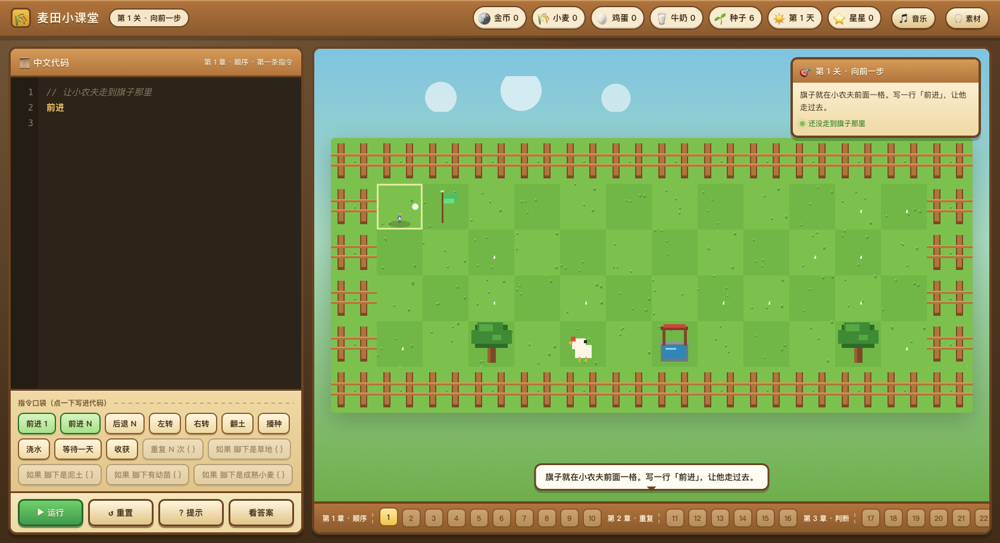
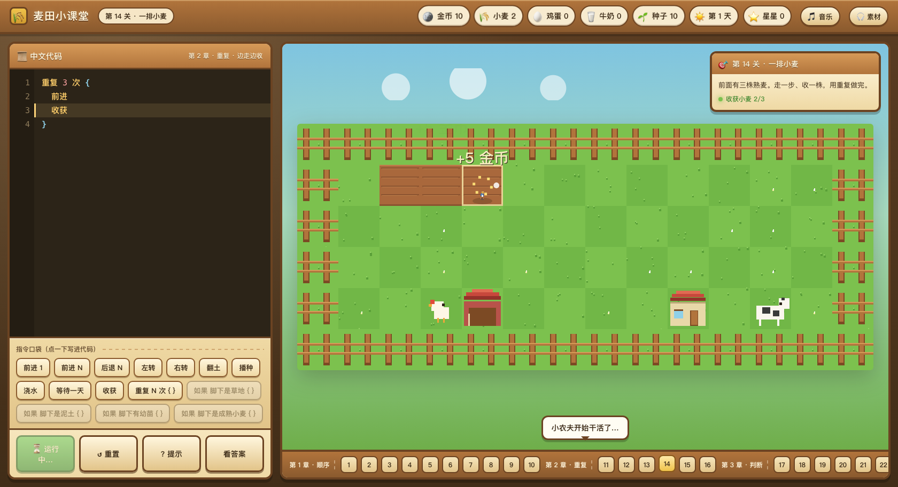
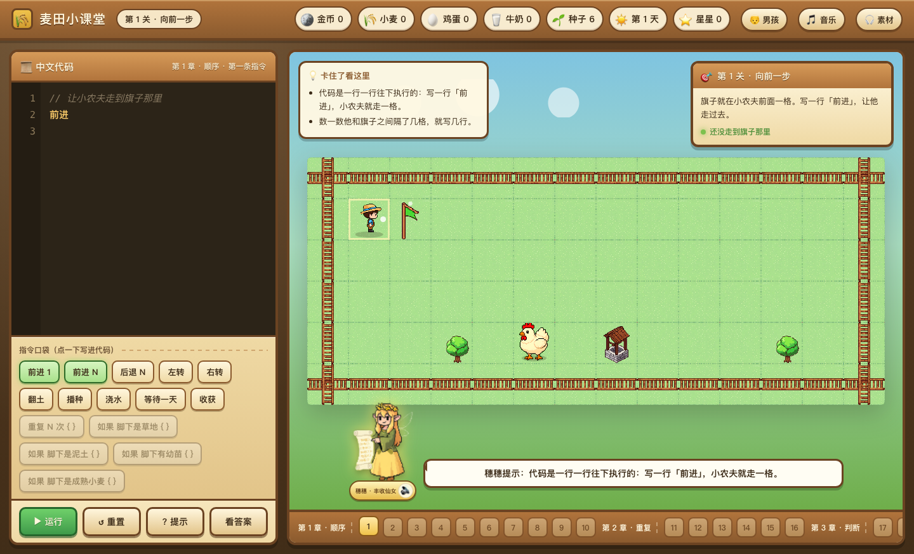

# 🌾 麦田小课堂

一个把 **中文代码指令** 和 **像素农场养成** 揉在一起的编程入门小游戏。

孩子在小木屋里写中文"代码"，小农夫就在农田里照着做：往前走、翻土、播种、浇水、等一天、收小麦。
一边通关，一边把**顺序、重复、判断**三大编程基础用身体记住。

[](https://github.com/alucardulad/code-farm/actions/workflows/ci.yml)
[](LICENSE)
[](package.json)







---

## 快速开始

```bash
npm run dev          # 启动本地服务器，浏览器打开 http://localhost:5173
npm test             # 关卡自检（26 关参考解全部真跑一遍）
```

零依赖：不需要 `npm install`，只用 Node 内置模块，Node 18 及以上都能跑。

`npm test` 会把 26 关的参考解逐条真跑一遍，同时校验地图合法性、每关只引入一个新概念。推送到 GitHub 后由 CI 在 Node 18 / 20 / 22 / 24 上再验一遍。

---

## 玩法

1. 左边是 **中文代码框**，可以在里面手写代码，也可以点击下面的「指令口袋」把指令插进去。
2. 点 **▶ 运行**，小农夫会一行一行执行；正在执行的那一行会亮起来。
3. 完成右边任务卡上的目标就算过关，按行动次数评三星。

代码写错了不会"炸掉"，只会在出错的那一行标红，并给一句人话提示，比如：

> 这块地还没翻过，先用「翻土」吧
> 这一章还用不了「重复」，先把每一步写成一行

---

## 中文代码语法

一行一条指令，分号可有可无，`//` 或 `#` 后面是注释。

```text
前进 3          // 往前走 3 格
后退 2          // 不倒车退 2 格
左转 / 右转      // 换个方向
翻土            // 把脚下的草地翻成松土
播种            // 在松土上撒种子
浇水            // 给脚下幼苗浇水
等待一天        // 浇过水的幼苗过一晚就长大了
收获            // 收下成熟小麦，+5 金币 +2 种子
喂鸡            // 自由农场：在鸡舍旁用稻草喂饱鸡群
收鸡蛋          // 自由农场：把鸡舍里的鸡蛋收进背包

重复 3 次 {
  前进
  翻土
}

如果 脚下是草地 {
  翻土
}
```

判断条件一共四种：`脚下是草地`、`脚下是泥土`、`脚下有幼苗`、`脚下是成熟小麦`。

### 通关后的自由农场

26 关全部完成后会解锁 **自由农场**。这里没有过关目标，农田、资源、天数和鸡舍
状态会持续保存，每次点运行都是接着上次的农场继续干活。

自由农场增加一条养殖循环：

```text
种小麦 → 收获小麦（额外得到 1 捆稻草）
  → 走到鸡舍旁「喂鸡」
  → 「等待一天」
  → 走到鸡舍旁「收鸡蛋」
```

每只鸡每天需要 1 捆稻草，喂饱后第二天会在鸡舍里下 1 枚蛋；鸡蛋不会自动进背包，
要靠近鸡舍写「收鸡蛋」才能收走。关卡里的 `等待一天` 规则不变。

---

## 关卡设计

课程分 **4 章 26 关**，沿用《地牢围攻》那套教学关卡规范：

| 章节 | 关卡 | 这一章学什么 |
| --- | --- | --- |
| 第 1 章 · 顺序 | 1~10 | 前进、转向、后退、翻土、播种、浇水、等待、收获 |
| 第 2 章 · 重复 | 11~16 | `重复 N 次 { ... }`，把重复劳动收起来 |
| 第 3 章 · 判断 | 17~22 | `如果 脚下是... { ... }`，先看再决定 |
| 第 4 章 · 综合 | 23~26 | 循环里套判断，一个人管好一片田 |

几条不打折扣的规矩：

- **一关只教一个新东西**，新指令不会提前出现在初始代码里。
- **初始代码不是答案**（第 1 关留一行做示范），孩子必须自己动手写。
- **本章没教的语法会被"教学拦截"**，给的是提示而不是报错。
- **每关的参考解都会被自动测试跑一遍**，保证关卡一定过得去，并且参考解能拿三星。

想加新关卡，只要在 `src/core/levels.js` 里加一条数据，然后跑 `npm test` —— 测试会替你验证地图合法、参考解能通关、一关没有塞两个新概念。

---

## 音频

**背景音乐**：轻快的尤克里里（第 1~2 章）与温和钢琴（第 3~4 章）交叉淡入淡出，
另叠一层很轻的鸟鸣环境音；点运行时代码音乐会自动压低，不盖住音效。

**音效**：走路踩草、翻土、播种、浇水、发芽、收获、金币、鸡叫、牛叫、
公鸡打鸣、按钮、走不通、代码报错、过关小号和通关庆祝，全部接在对应事件上。

**丰收仙女语音**：农田提示位新增女性精灵教师「牧场丰收仙女 · 穗穗」。
点“提示”时，屏幕会展开本关提示，她用坎蒂丝音色朗读该关第一条精确指导；
写错代码或看答案时也会给出语音引导。语音使用本机原神 TTS 预生成，
运行游戏不联网。关卡提示有改动后运行：

```bash
node tools/generate_tutor_voice.mjs --force   # 只补缺失的可去掉 --force
```

脚本默认读本机的 TTS 目录与 Python 环境，换机器时用环境变量覆盖：

```bash
TTS_PYTHON=/path/to/venv/bin/python TTS_SERVER=/path/to/tts_server.py \
  node tools/generate_tutor_voice.mjs
```

生成的语音已经提交进仓库（`src/assets/voice/`），普通玩家不用跑这一步。

素材**不复制进项目**，直接读本机统一素材库（和有声小说项目共用）：

```
/media/sfx/*    →  ~/Documents/ChatGPT/语音合成/音效库
/media/music/*  →  ~/Documents/ChatGPT/语音合成/音乐库
```

如果素材取不到（比如直接双击打开 `index.html`），游戏会自动退回 WebAudio 合成音，
照样有反馈，不会报错也不会静音。

### 素材致谢

背景音乐需要署名（CC BY）：

| 曲目 | 作者 | 许可 | 用途 |
| --- | --- | --- | --- |
| Happy Coconuts (60s Edit) | HoneyTune | CC BY | 第 1~2 章 |
| An Easy Step of Luck | Efr - Enhanced Full Rate | CC BY | 第 3~4 章 |

音效均来自 Freesound，全部为 **CC0**（免署名，仍在此致谢）：
Wet Click / 脚步 / Space Swoosh / shoveling-dirt / Planting (Seeds) / Pouring Liquid /
water drop / Triple Ping / Pull Plant / Retro Coin 01 / Rooster Crow 1 / Chicken clucking 3 /
z-moo01 / Plop! / Buzzer / victory chime / Win Spacey / Bird chirping。

完整的作者与来源链接在游戏右上角 **🎧 素材** 按钮里，数据维护在 `src/core/credits.js`。

---

## 目录结构

```
src/
├── core/                 纯逻辑，不碰任何画面
│   ├── interpreter.js    中文代码：词法 → 语法 → 逐行执行
│   ├── tutor.js          教学拦截：本章没教的语法给提示而不是报错
│   ├── world.js          农场规则：移动、翻土、生长、收获、金币
│   ├── levels.js         26 关关卡数据
│   ├── runner.js         把解释器和世界接起来，每步检查目标
│   ├── engine.js         事件 → 补间动画 / 特效 / 音效
│   ├── render.js         Canvas2D 像素画笔
│   ├── audio.js          真实录音 + 合成音兜底
│   ├── tutor-lines.js    丰收仙女台词与配音清单
│   └── credits.js        素材致谢
├── ui/
│   ├── app.js            面板装配、存档、关卡切换
│   ├── editor.js         中文代码编辑器（行号 / 高亮 / 报错行）
│   └── styles.css        木牌像素风界面
└── game.js               入口

tools/dev-server.mjs      零依赖静态服务器 + 素材库映射
tools/generate_tutor_voice.mjs  用坎蒂丝音色批量生成仙女提示语音
tests/levels.test.mjs     关卡与解释器自检
```

玩法逻辑（`core/`）完全不知道"画面"的存在，所以关卡能脱离浏览器在 Node 里跑测试；
换美术、换音效、换界面都不会碰到规则本身。

---

## 许可

游戏代码以 **MIT** 许可开源，见 [LICENSE](LICENSE)。

第三方素材不跟着代码走 MIT，各自保留原许可，署名信息在游戏内右上角 **🎧 素材**
按钮和 `src/core/credits.js` 里：

| 素材 | 许可 | 说明 |
| --- | --- | --- |
| 背景音乐 | CC BY | 需署名作者，未提交进仓库，需自备素材库 |
| 音效 | CC0 | 来自 Freesound，免署名 |
| 丰收仙女语音 | 随代码 | 由本机原神 Bert-VITS2 预先生成，提交在 `src/assets/voice/` |

直接双击 `index.html` 也能玩，只是拿不到本机音乐库的音乐，此时会自动退回 WebAudio
合成音。
