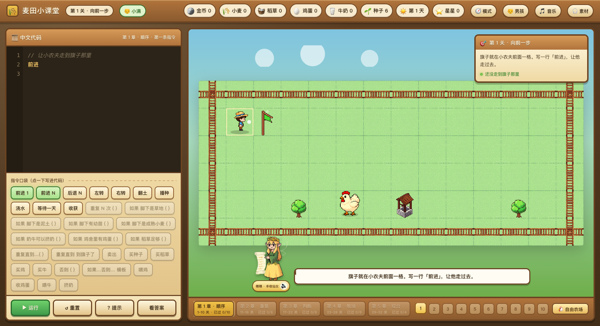
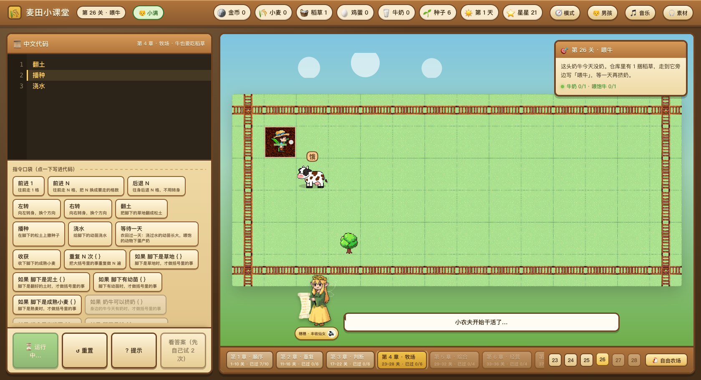
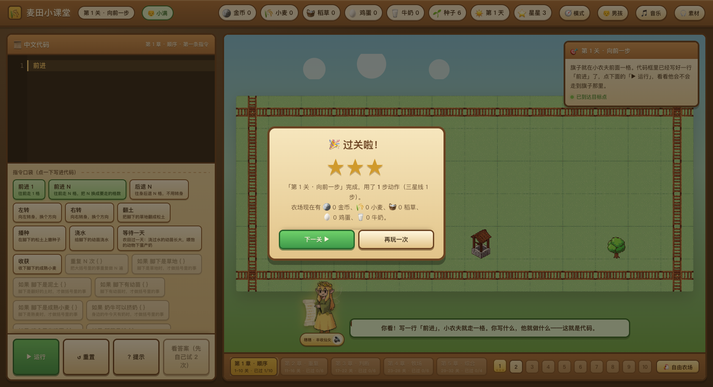
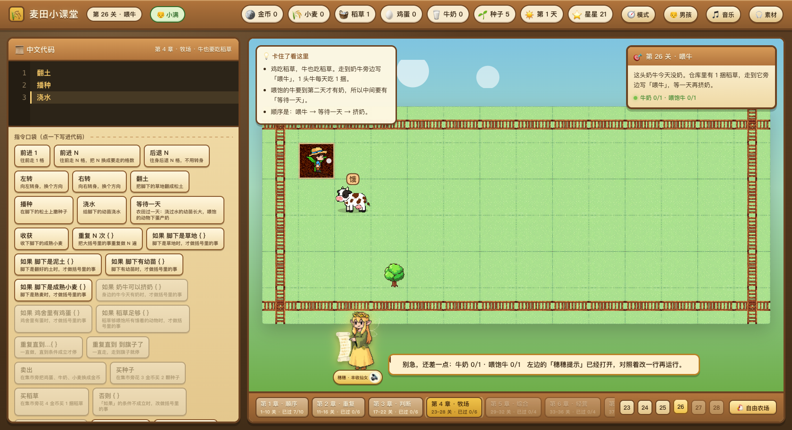
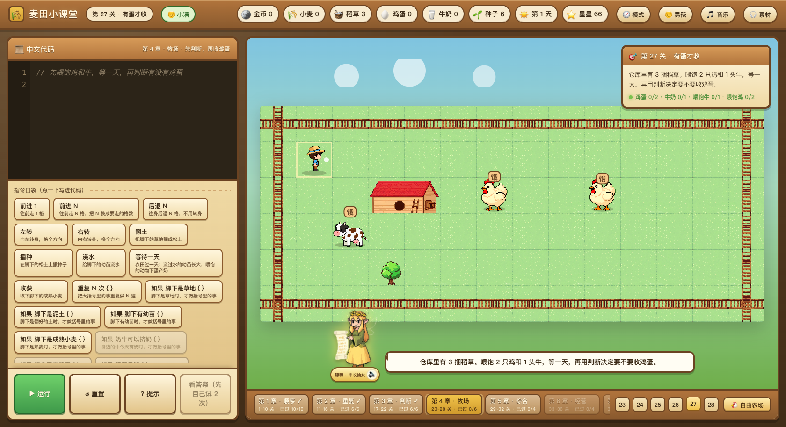
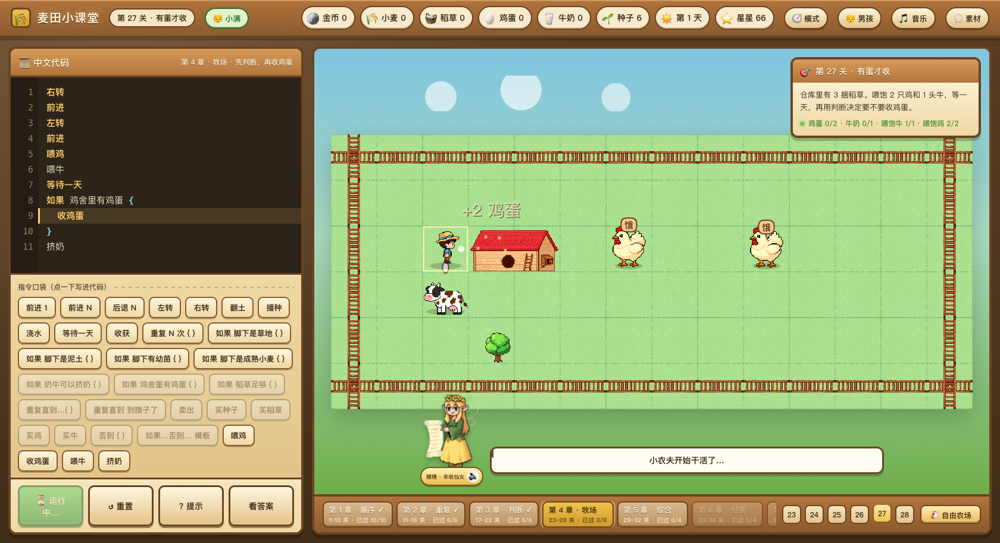

# 🌾 麦田小课堂

**用中文写代码，教小农夫种地。** 一个把「中文代码指令」和「像素农场养成」揉在一起的编程入门小游戏。

孩子在左边的小木屋里写中文代码，小农夫就在右边的农田里照着做：往前走、翻土、播种、浇水、等一天、收小麦，
再去**喂鸡、喂牛、收鸡蛋、挤牛奶**，最后拉到集市上把收成换成金币。44 关打下来，
**顺序、重复、判断、两选一、条件循环**五大编程基础，
就跟着一锄头一锄头长进手里了。

[](https://github.com/alucardulad/code-farm/actions/workflows/ci.yml)
[](LICENSE)
[](package.json)

## ⬇️ 想直接玩

去 [Releases](https://github.com/alucardulad/code-farm/releases) 下载 **`code-farm-v1.0.0.html`，双击就玩**——
不用装 Node、不用起服务器、不用联网，精灵图和丰收仙女的语音都打包在这一个文件里。

想读源码、改关卡、自己加新关卡，看下面的「快速开始」。

## ✨ 这一版有什么

| 特色 | 说明 |
| --- | --- |
| 🀄 **中文代码，认字就能写** | 一行一条指令，分号可有可无，`//` 和 `#` 写注释 |
| 🧱 **44 关 8 章，一关只教一个新东西** | 顺序 → 重复 → 判断 → 牧场 → 综合 → 经营 → 集市 → 自动农活，新语法绝不提前冒出来 |
| 🐣 **写错不炸，只讲人话** | 标红出错那一行，提示"这块地还没翻过，先用「翻土」吧" |
| 🧚 **丰收仙女穗穗** | 点「提示」展开本关要点，还用坎蒂丝音色念出来；看答案前先劝你"自己写一遍" |
| 🧑‍🌾 **开篇建角色** | 先看开篇页，选男孩或女孩、写下姓名，姓名会显示在顶栏 |
| 🌾🐔🐄 **种地 · 养鸡 · 牧牛** | 收获小麦得稻草，稻草既是鸡的早饭也是牛的口粮；喂饱的鸡下蛋、喂饱的牛产奶，都要走到跟前才收得走 |
| 🐔 **教学模式 / 自由模式任选** | 建完角色直接选模式；自由模式养着 3 只鸡、3 头牛，每天有农活清单和当日结算 |
| 🧾 **自由农场经营账本** | 每轮跑完报一次「这一轮收了多少」：小麦、鸡蛋、牛奶、金币都记在账上 |
| 🏪 **集市经济闭环** | `卖出` 鸡蛋牛奶小麦换金币，`买种子` / `买稻草` 把金币花出去，农场能一直转 |
| 🔁 **条件循环「重复直到」** | 次数不用数：`重复直到 前方是成熟小麦 { 前进 }`，条件一成立就停；写反了会被防死循环拦下 |
| ⭐ **按步数评三星** | 同一关写得越利索星星越多，44 关进度和星星都存在本地 |
| 👦👧 **男孩女孩一键换** | 右上角随时换小农夫形象 |
| 📦 **零依赖纯静态** | 只用 Node 内置模块跑测试，游戏本身不依赖任何框架 |

## 📷 截图

| 第 1 关 · 看懂第一条指令 | 麦田劳作 · 一边跑一边高亮 |
| --- | --- |
|  |  |
| **过关结算 · 按步数评三星** | **丰收仙女穗穗 · 会开口的提示** |
|  |  |
| **牧场章 · 喂鸡、喂牛、收鸡蛋、挤奶** | **收鸡蛋 · 鸡蛋进背包才算数** |
|  |  |

---

## 快速开始

```bash
npm run dev          # 启动本地服务器，浏览器打开 http://localhost:5173
npm test             # 关卡自检（44 关参考解全部真跑一遍 + 渲染冒烟）
npm run build        # 打包单文件 HTML 到 dist/（就是 Release 里那个附件）
npm run shots        # 改过界面后重拍 README 预览图（需要先跑着 npm run dev）
```

零依赖：不需要 `npm install`，只用 Node 内置模块，Node 18 及以上都能跑。

`npm test` 会把 44 关的参考解逐条真跑一遍，同时校验地图合法性、每关只引入一个新概念、配音和关卡提示是否同步，并把每张地图都真渲染一帧（防止新建筑画崩了整帧）。推送到 GitHub 后由 CI 在 Node 18 / 20 / 22 / 24 上再验一遍。

---

## 玩法

开篇三步走：

1. **开篇页**：认识这片会听懂中文代码的农田，点「开始旅程」。
2. **创建小农夫**：选男孩或女孩，写下人物姓名（最多 8 个字）。
3. **选择模式**：选 **教学模式** 或 **自由模式**，正式开始。

进入游戏后：

1. 教学模式左边是 **中文代码框**，可以在里面手写代码，也可以点击下面的「指令口袋」把指令插进去。
2. 点 **▶ 运行**，小农夫会一行一行执行；正在执行的那一行会亮起来。
3. 完成右边任务卡上的目标就算过关，按行动次数评三星。

姓名和性别都存在本地：顶栏会显示「👦 姓名」或「👧 姓名」，点右上角「模式」回到选择页，
再点「修改角色和姓名」就能随时改。

代码写错了不会"炸掉"，只会在出错的那一行标红，并给一句人话提示，比如：

> 这块地还没翻过，先用「翻土」吧
> 这一章还用不了「重复」，先把每一步写成一行

---

## 中文代码语法

一行一条指令，分号可有可无，`//` 或 `#` 后面是注释。

```text
前进 3          // 往前走 3 格
后退 2          // 不倒车退 2 格
左转 / 右转      // 换个方向
翻土            // 把脚下的草地翻成松土
播种            // 在松土上撒种子
浇水            // 给脚下幼苗浇水
等待一天        // 浇过水的幼苗过一晚就长大了
收获            // 收下成熟小麦，+5 金币 +2 种子
喂鸡            // 在鸡舍旁用稻草喂饱鸡群（1 只鸡 1 天 1 捆）
喂牛            // 在奶牛旁用稻草喂饱奶牛（1 头牛 1 天 1 捆）
卖出            // 在集市旁把鸡蛋、牛奶、小麦换成金币
买种子          // 在集市旁花 3 金币买 2 颗种子
买稻草          // 在集市旁花 4 金币买 1 捆稻草
买鸡 / 买牛      // 在集市旁花 12 / 20 金币扩大养殖规模
收鸡蛋          // 把鸡舍里的鸡蛋收进背包
挤奶            // 在奶牛旁挤 1 瓶牛奶（一头牛 1 天 1 瓶）

重复 3 次 {
  前进
  翻土
}

如果 脚下是草地 {
  翻土
}

如果 奶牛可以挤奶 {
  挤奶
}

如果 脚下是成熟小麦 {
  收获
}
否则 {
  翻土
}

如果 稻草足够 {
  喂鸡
}
否则 {
  买稻草
}

重复 3 次 {           // 次数事先数好
  前进
}

重复直到 前方是成熟小麦 {   // 次数交给条件决定
  前进
}
```

判断条件一共九种：`脚下是草地`、`脚下是泥土`、`脚下有幼苗`、`脚下是成熟小麦`、
`奶牛可以挤奶`、`鸡舍里有鸡蛋`、`稻草足够`、`前方是成熟小麦`、`到旗子了`。

`如果` 和 `重复直到` 共用这套条件。前者是「成不成立都只做一次」，后者是
「不成立就一直做」。`重复直到` 单条最多跑 100 遍，条件写反了会被人话提示拦住，
不会把浏览器转死。

### 农场是怎么转起来的

种地、养鸡、牧牛共用一条产出链，教学关和自由模式都按这套规则结算：

```text
翻土 → 播种 → 浇水 → 等待一天 → 收获
                            ↓
                    小麦 +2 种子 +5 金币 +1 稻草
                            ↓
        ┌───────────────────┴───────────────────┐
        ↓                                       ↓
   走到鸡舍旁「喂鸡」                    走到奶牛旁「喂牛」
    （1 只鸡 1 天 1 捆稻草）             （1 头牛 1 天 1 捆稻草）
        ↓                                       ↓
   「等待一天」→ 鸡舍里攒下鸡蛋         「等待一天」→ 奶牛产奶
        ↓                                       ↓
   走到鸡舍旁「收鸡蛋」                  走到奶牛旁「挤奶」
```

**集市**把最后一环补上了：收成可以换钱，钱可以再买种子和稻草，农场能一直转下去。

| 集市生意 | 价格 |
| --- | --- |
| 卖出 鸡蛋 | 3 金币 / 枚 |
| 卖出 牛奶 | 5 金币 / 瓶 |
| 卖出 小麦 | 2 金币 / 袋 |
| 买种子 | 3 金币 → 2 颗 |
| 买稻草 | 4 金币 → 1 捆 |
| 买鸡 | 12 金币 → 1 只鸡 |
| 买牛 | 20 金币 → 1 头牛 |

三条养殖规则的小细节：

- 稻草是**鸡和牛共同的口粮**：收获 1 株小麦得 1 捆稻草，喂鸡还是喂牛要自己安排。
- 鸡要**先喂饱**才下蛋，鸡蛋会**留在鸡舍里**，人走过去写「收鸡蛋」才进背包。
- 奶牛**喂饱后第二天才有新奶**，一头牛 1 天 1 瓶，挤完当天就没奶了。
- 判断条件 `奶牛可以挤奶`、`鸡舍里有鸡蛋` 可以直接用在「如果」里，让代码自己挑活干。

### 自由模式

自由模式不需要通关，启动时就能直接选择。这里没有过关目标，农田、资源、天数、
动物饱食和牛奶状态都会持续保存，每次点运行都是接着上次的农场继续干活。
一开始就配了 **3 只鸡、3 头奶牛**和一座**集市**，其中 1 头牛当天没奶，正好用来试「喂牛」。

任务卡会根据农场现状给出**每日农活清单**：鸡舍有蛋先收蛋，有牛能挤先挤奶，
动物饿了且稻草够就提醒去喂，稻草不够就提醒先收获小麦。

**经营账本**：顶栏一直显示 3 只鸡 / 3 头牛里各有几只饿着、有几头能挤；
每跑完一轮，气泡里会报一次当日结算，例如：

> 这一轮收获 4 株小麦、收到 3 枚鸡蛋、挤了 1 瓶牛奶。账本：🌾 4 小麦 · 🥚 3 鸡蛋 · 🥛 1 牛奶 · 🪙 20 金币

3 只鸡加 3 头牛一天要吃掉 6 捆稻草，所以多种几格小麦才够用；
稻草不够时也可以去集市「买稻草」，前提是口袋里有金币；
攒够金币还能「买鸡」「买牛」扩大规模——但多一张嘴就多一份口粮，`稻草足够` 会自动跟着算。

---

## 关卡设计

课程分 **8 章 44 关**，沿用《地牢围攻》那套教学关卡规范：

| 章节 | 关卡 | 这一章学什么 |
| --- | --- | --- |
| 第 1 章 · 顺序 | 1~10 | 前进、转向、后退、翻土、播种、浇水、等待、收获 |
| 第 2 章 · 重复 | 11~16 | `重复 N 次 { ... }`，把重复劳动收起来 |
| 第 3 章 · 判断 | 17~22 | `如果 脚下是... { ... }`，先看再决定 |
| 第 4 章 · 牧场 | 23~28 | `喂鸡`、`收鸡蛋`、`挤奶`、`喂牛`，把收下来的稻草变成鸡蛋和牛奶 |
| 第 5 章 · 综合 | 29~32 | 循环里套判断，用 `如果 奶牛可以挤奶` 挑活干，完成种地 + 养鸡 + 牧牛的一天 |
| 第 6 章 · 经营 | 33~36 | `如果 ... 否则 ...` 两选一，把种地、养鸡、牧牛安排成一整天的经营 |
| 第 7 章 · 集市 | 37~40 | `卖出`、`买种子`、`买稻草`、`稻草足够`，把农产品换成金币再投回农场 |
| 第 8 章 · 自动农活 | 41~44 | `重复直到`、`前方是成熟小麦`、`到旗子了`，不知道做几遍就让条件决定 |

几条不打折扣的规矩：

- **一关只教一个新东西**，新指令不会提前出现在初始代码里。
- **初始代码不是答案**（第 1 关留一行做示范），孩子必须自己动手写。
- **本章没教的语法会被"教学拦截"**，给的是提示而不是报错；前三章偷用「喂鸡 / 喂牛 / 收鸡蛋 / 挤奶」会被拦住引导到第 4 章，前五章偷用「否则」引导到第 6 章，前六章偷用「卖出 / 买种子 / 买稻草」引导到第 7 章，
前七章偷用「重复直到」引导到第 8 章。
- **每关的参考解都会被自动测试跑一遍**，保证关卡一定过得去，并且参考解能拿三星。

想加新关卡，只要在 `src/core/levels.js` 里加一条数据，然后跑 `npm test` —— 测试会替你验证地图合法、参考解能通关、一关没有塞两个新概念。

---

## 音频

**背景音乐**：轻快的尤克里里（第 1~2 章）与温和钢琴（第 3 章以后）交叉淡入淡出，
另叠一层很轻的鸟鸣环境音；点运行时代码音乐会自动压低，不盖住音效。

**音效**：走路踩草、翻土、播种、浇水、发芽、收获、金币、鸡叫、牛叫、挤奶、
公鸡打鸣、按钮、走不通、代码报错、过关小号和通关庆祝，全部接在对应事件上。

**丰收仙女语音**：农田提示位新增女性精灵教师「牧场丰收仙女 · 穗穗」。
点“提示”时，屏幕会展开本关提示，她用坎蒂丝音色朗读该关第一条精确指导；
写错代码或看答案时也会给出语音引导。语音使用本机原神 TTS 预生成，
运行游戏不联网。关卡提示有改动后运行：

```bash
node tools/generate_tutor_voice.mjs --force   # 只补缺失的可去掉 --force
```

脚本会用 `src/assets/voice/voice-manifest.json` 记录每句台词的指纹，只补「台词改了或
文件缺失」的那些；`npm test` 会校验提示文本和配音是否同步，防止录音和屏幕上写的对不上。
只想补个别关卡时可以写 `--only=level-26,level-27`。

脚本默认读本机的 TTS 目录与 Python 环境，换机器时用环境变量覆盖：

```bash
TTS_PYTHON=/path/to/venv/bin/python TTS_SERVER=/path/to/tts_server.py \
  node tools/generate_tutor_voice.mjs
```

生成的语音已经提交进仓库（`src/assets/voice/`），普通玩家不用跑这一步。

素材**不复制进项目**，直接读本机统一素材库（和有声小说项目共用）：

```
/media/sfx/*    →  ~/Documents/ChatGPT/语音合成/音效库
/media/music/*  →  ~/Documents/ChatGPT/语音合成/音乐库
```

素材取不到时（比如玩 Release 里的单文件版、或者在没装素材库的机器上跑），
游戏会自动退回 WebAudio 合成音，照样有反馈，不会报错也不会静音。

### 素材致谢

背景音乐需要署名（CC BY）：

| 曲目 | 作者 | 许可 | 用途 |
| --- | --- | --- | --- |
| Happy Coconuts (60s Edit) | HoneyTune | CC BY | 第 1~2 章 |
| An Easy Step of Luck | Efr - Enhanced Full Rate | CC BY | 第 3 章以后 |

音效均来自 Freesound，全部为 **CC0**（免署名，仍在此致谢）：
Wet Click / 脚步 / Space Swoosh / shoveling-dirt / Planting (Seeds) / Pouring Liquid /
water drop / Triple Ping / Pull Plant / Retro Coin 01 / Rooster Crow 1 / Chicken clucking 3 /
z-moo01 / Plop! / Buzzer / victory chime / Win Spacey / Bird chirping。
（`z-moo01` 与 `Pouring Liquid` 同时用在挤奶上。）

完整的作者与来源链接在游戏右上角 **🎧 素材** 按钮里，数据维护在 `src/core/credits.js`。

---

## 目录结构

```
src/
├── core/                 纯逻辑，不碰任何画面
│   ├── interpreter.js    中文代码：词法 → 语法 → 逐行执行
│   ├── tutor.js          教学拦截：本章没教的语法给提示而不是报错
│   ├── world.js          农场规则：移动、翻土、生长、收获、养殖、集市买卖
│   ├── levels.js         44 关关卡数据
│   ├── runner.js         把解释器和世界接起来，每步检查目标
│   ├── engine.js         事件 → 补间动画 / 特效 / 音效
│   ├── render.js         Canvas2D 像素画笔
│   ├── audio.js          真实录音 + 合成音兜底
│   ├── tutor-lines.js    丰收仙女台词与配音清单
│   └── credits.js        素材致谢
├── ui/
│   ├── app.js            面板装配、存档、关卡切换
│   ├── editor.js         中文代码编辑器（行号 / 高亮 / 报错行）
│   └── styles.css        木牌像素风界面
└── game.js               入口

tools/dev-server.mjs      零依赖静态服务器 + 素材库映射
tools/generate_tutor_voice.mjs  用坎蒂丝音色批量生成仙女提示语音
tools/build-single.mjs    打包成单文件 HTML（产物在 dist/）
tools/capture-preview.mjs 用无头 Chrome 重拍 README 里的预览图
tests/levels.test.mjs     关卡与解释器自检
```

玩法逻辑（`core/`）完全不知道"画面"的存在，所以关卡能脱离浏览器在 Node 里跑测试；
换美术、换音效、换界面都不会碰到规则本身。

---

## 许可

游戏代码以 **MIT** 许可开源，见 [LICENSE](LICENSE)。

第三方素材不跟着代码走 MIT，各自保留原许可，署名信息在游戏内右上角 **🎧 素材**
按钮和 `src/core/credits.js` 里：

| 素材 | 许可 | 说明 |
| --- | --- | --- |
| 背景音乐 | CC BY | 需署名作者，未提交进仓库，需自备素材库 |
| 音效 | CC0 | 来自 Freesound，免署名 |
| 丰收仙女语音 | 随代码 | 由本机原神 Bert-VITS2 预先生成，提交在 `src/assets/voice/` |

Release 里的单文件 `code-farm-vX.Y.Z.html` 把代码、精灵图和仙女语音都内联了进去，
双击即玩，不需要服务器；它拿不到本机素材库的音乐和音效，会自动退回 WebAudio 合成音，
玩法完全不受影响。想听原声音乐就按「快速开始」起本地服务器。
